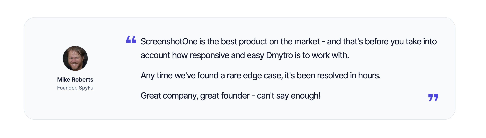

# n8n-nodes-screenshotone


[](https://screenshotone.com/)

`n8n-nodes-screenshotone` is an n8n community node. It lets you use [ScreenshotOne](https://screenshotone.com/) in your n8n workflows.

ScreenshotOne is a service that allows you to take screenshots of web pages, generate PDFs, convert HTML or Markdown to images and more.

[](https://screenshotone.com/customers/)

Check out what [ScreenshotOne customers say about the API](https://screenshotone.com/customers/) and why it is considered one of the best screenshot APIs.

[n8n](https://n8n.io/) is a [fair-code licensed](https://docs.n8n.io/reference/license/) workflow automation platform.

- [Installation](#installation)
- [Operations](#operations)
- [Credentials](#credentials)
- [Compatibility](#compatibility)
- [Usage](#usage)
- [Resources](#resources)
- [Development](#development)
- [Version history](#version-history)
- [ScreenshotOne](#screenshotone)
  - [Use cases](#use-cases)
  - [Customers](#customers)
- [License](#license)

## Installation

### Community Nodes

Follow the [installation guide](https://docs.n8n.io/integrations/community-nodes/installation/) in the n8n community nodes documentation:

1. Go to `Settings` > `Community Nodes`.
2. Select `Install`.
3. Enter `n8n-nodes-screenshotone` in `Enter npm package name`.
4. Agree to the risks of using community nodes.
5. Select `Install`.


## Operations

1. **Screenshot** any website, HTML or Markdown. Returns result as image.
2. **Full Page Screenshot** is the same as **Screenshot**, but returns the full page as an image.
3. **PDF** from rendering PDFs from URLs, HTML or Markdown. Returns result as PDF.
4. **Scrolling Screenshot** it is a [scrolling screenshot feature from ScreenshotOne](https://screenshotone.com/scrolling-screenshots/). Results as video or GIF.
5. **Record Short Video** is to record a short video of a website, HTML or Markdown. Results as video or GIF.

For scrolling screenshots and video check out the [ScreenshotOne documentation](https://screenshotone.com/docs/animated-screenshots/).

## Credentials

To use ScreenshotOne node, you will need to authenticate with the ScreenshotOne API.

1. [Sign up for or sign in to a ScreenshotOne account](https://dash.screenshotone.com/).
2. [Create if needed and copy the API (access) key](https://dash.screenshotone.com/access).
3. Create new credentials in n8n:
   3.1. Add and use the ScreenshotOne node in your workflow.
   3.2. Under "Credential to connect with", click "Create New Credential".
   3.3. Paste the API (access) key you copied in step 2.

Test the credentials and make sure it works:


## Compatibility

The node was created and tested with n8n version `1.98.2`. But there is no reason it won't work with older and newer versions.

## Usage

If you use n8n for the first time, check out the ["try it out" documentation ](https://docs.n8n.io/try-it-out/) to get started.

### Response types

ScreenshotOne may return the response in different formats based on the request options:

- `json` - for JSON responses, e.g. for PDF or screenshot with URLs.
- `text` - for text responses, e.g. raw HTML.
- `base64` - for image responses.

Examples:

```json
{
	"content_type": "application/json",
	"type": "json",
	"response": {
		"cache_url": "https://<URL of the screenshot in cache>"
	}
}
```

Or:

```json
{
	"content_type": "text/html",
	"type": "text",
	"response": "<HTML body>"
}
```

## Resources

- [n8n community nodes documentation](https://docs.n8n.io/integrations/#community-nodes)
- [ScreenshotOne API documentation](https://screenshotone.com/docs/)
- [ScreenshotOne](https://screenshotone.com/)
- [ScreenshotOne Dashboard](https://dash.screenshotone.com/)

## Version history

- 0.1.2 - Initial release of the ScreenshotOne node for n8n 🥳

## Development

Check out [documentation on creating nodes](https://docs.n8n.io/integrations/creating-nodes/) for detailed information on building and developing the node.

0. Install dependencies:

```bash
npm install
```

1. Build the node

```bash
npm run build
```

2. Link the node to n8n from the node directory

```bash
npm link
```

3. In your `~/.n8n/nodes` directory, link the node:

```bash
npm link n8n-nodes-screenshotone
```

4. Run n8n:

```bash
n8n start
```

Once the node is linked, you need to only rebuild and restart n8n to see the changes.

## ScreenshotOne

### Use cases

You can find [all the use cases on the ScreenshotOne official website](https://screenshotone.com/use-cases/), including but not limited to:

- [Automating Open Graph image generation](https://screenshotone.com/use-cases/open-graph-images/)
- [Generating personalized videos](https://screenshotone.com/use-cases/automate-personalized-videos/)
- [Generating marketing content](https://screenshotone.com/use-cases/generate-advertising-content/)

And [many more](https://screenshotone.com/use-cases/).

### Customers

[](https://screenshotone.com/customers/)

Check out what [ScreenshotOne customers say about the API](https://screenshotone.com/customers/) and why it is considered one of the best screenshot APIs.

## License

[MIT](https://github.com/n8n-io/n8n-nodes-starter/blob/master/LICENSE.md)

## License

This project is licensed [under the MIT License](LICENSE.md).
